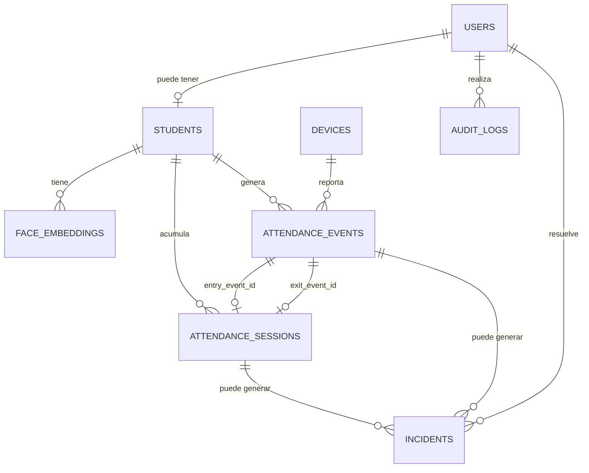
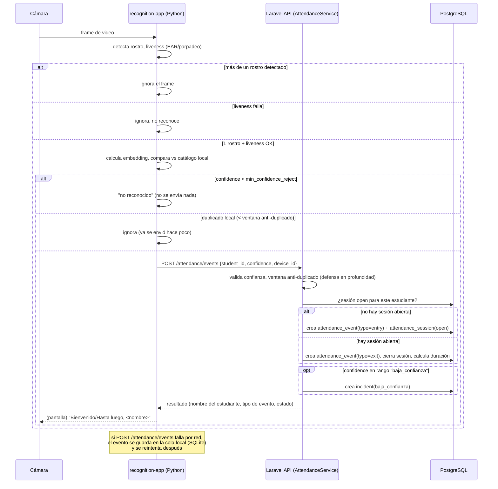

# Facelog — Etapa 2: Diseño

> Basado en [docs/01-analisis.md](./01-analisis.md) (Etapa 1, aprobada). Este documento aterriza esa arquitectura a: estructura de carpetas por componente, esquema de base de datos, contrato de API, flujos de reconocimiento y modelo de autorización. Aún no contiene código de implementación (eso es Etapa 3 en adelante).

---

## 1. Decisión de diseño clave: cómo se hace el enrolamiento facial

> **Actualizado tras revisión (2026-09-09)**: la primera versión de este documento proponía enrolar en el laboratorio vía el `recognition-app`; luego se corrigió a subida por la web. En una segunda corrección se precisó **quién** sube la foto: **el propio estudiante sube su foto inicial de enrolamiento** (autoservicio, una sola vez); a partir de ahí esa vía queda completamente cerrada para él — **solo el administrador puede modificarla después.** Esta sección refleja el diseño ya corregido.

Laravel (PHP) no puede ejecutar DeepFace directamente, así que subir una foto desde la web implica que, en algún punto, algo escrito en Python la procese y devuelva el embedding. Se resuelve así, sin necesidad de mantener un servicio Python corriendo permanentemente:

1. El **estudiante**, desde su propio panel (autenticado), sube su foto de enrolamiento → `POST /api/students/{id}/face-photo` (multipart). Esto es una excepción puntual y deliberada a que el estudiante solo "consulte" (Etapa 1 §4): es su propio dato biométrico, capturado una sola vez, bajo su propio control inicial.
2. Laravel guarda la imagen **de forma transitoria** en un disco privado (`storage/app/tmp-enrollment`, no público), nunca en el disco `public` ni en un bucket externo.
3. Laravel invoca, como proceso hijo (vía `Illuminate\Support\Facades\Process`), un script de `recognition-app` (`scripts/compute_embedding.py <ruta_imagen>`) que reutiliza el mismo módulo de detección/embedding (`src/recognition/`) que usa la app del laboratorio para reconocer en tiempo real — así el embedding de enrolamiento y el de comparación diaria salen exactamente del mismo pipeline, evitando incompatibilidades.
4. El script responde por stdout un JSON: `{"embedding": [...], "modelo": "Facenet512"}`, o un error si no detecta ningún rostro, detecta más de uno, o el archivo no es una imagen válida.
5. Laravel **borra el archivo temporal inmediatamente** (en un bloque `finally`, se procese con éxito o falle), y solo entonces persiste el embedding resultante en `face_embeddings`. La foto original nunca queda guardada en ningún punto del sistema — esto conserva la decisión de la Etapa 1 de "no conservar fotos", solo que ahora la imagen transita brevemente por el servidor en vez de nunca salir del proceso Python del laboratorio.

**Regla de "una vez subida, solo el administrador puede modificarla":** se separan dos acciones distintas en la API, con autorización distinta cada una:
- `POST /api/students/{id}/face-photo` — **crea** el enrolamiento inicial. La puede llamar **el propio estudiante** (solo sobre su propio registro) **o el admin** (por si el estudiante aún no tiene cuenta — recordar que `students.user_id` es nullable — o necesita ayuda). Si el estudiante ya tiene un embedding activo, responde `409 Conflict` y no hace nada. **El estudiante no tiene ningún otro endpoint disponible para tocar su enrolamiento después de esto** — no existe una ruta de "reemplazar" a la que él tenga acceso.
- `PUT /api/students/{id}/face-photo` — **reemplaza** el enrolamiento existente. **Exclusiva del rol `admin`**; el estudiante recibe `403 Forbidden` si intenta llamarla. Borra el embedding anterior y crea uno nuevo a partir de la nueva foto, y queda registrada en `audit_logs` (`action = face_profile_replaced`, con metadatos del embedding anterior — modelo y fecha, nunca el vector).

Es decir: la creación inicial es autoservicio (estudiante o admin), pero **toda modificación posterior pasa obligatoriamente por el admin**, y queda auditada. Esto se resuelve en la Policy (`FacePhotoPolicy`), no dejando que ningún otro flujo (p. ej. "editar mi perfil") pueda disparar un reemplazo.

**Consecuencias aceptadas de este cambio de diseño:**
- La imagen ahora sí viaja por la red (del navegador de quien la sube al servidor) y toca el disco del servidor por el tiempo de una request — antes no salía del laboratorio. Se mitiga con: subida solo por HTTPS en producción, disco privado no accesible públicamente, borrado inmediato garantizado.
- El backend Laravel necesita tener Python y las dependencias de `recognition-app` **instalados y accesibles en el mismo servidor** (para poder invocar el script como subproceso). Para el alcance de este proyecto universitario se asume que Laravel y `recognition-app` corren en la misma máquina/servidor de desarrollo o demo; si en el futuro se separan en servidores distintos, este paso tendría que convertirse en una llamada HTTP a un pequeño servicio Python — no es necesario ahora.
- Se simplifica a **un embedding activo por estudiante** (una sola foto), en vez de varios ángulos como se planteaba antes. Es una posible ligera pérdida de robustez del reconocimiento (menos variación de referencia), a cambio de un flujo más simple y controlable, que es lo que pidió el usuario.
- Se amplía ligeramente el rol `student` respecto a la lista original de la Etapa 1 (que era solo de consulta): ahora incluye "subir su propia foto de enrolamiento, una única vez". Se documenta aquí por transparencia — es la única acción de escritura que tiene el estudiante en todo el sistema.

**Flujo de trabajo resultante para dar de alta a un estudiante:**
1. El admin crea el registro del estudiante (matrícula, nombre, carrera, meta de horas) → `POST /api/students`.
2. El estudiante (una vez que tiene cuenta y accede a la plataforma) sube su foto de enrolamiento → `POST /api/students/{id}/face-photo`. Si el estudiante todavía no tiene cuenta, el admin puede hacerlo por él con el mismo endpoint.
3. Hasta que el paso 2 no se complete con éxito, el estudiante existe en el sistema pero no aparece en el catálogo que descarga la app del laboratorio, por lo que no puede ser reconocido por la cámara (visible en el panel admin como "sin enrolamiento biométrico").
4. Si la foto queda mal (mala iluminación, cambio físico importante, etc.), el estudiante **no puede corregirlo él mismo** — debe pedirle al administrador que use `PUT /api/students/{id}/face-photo` para reemplazarla.

---

## 2. Estructura de carpetas por componente

### 2.1 `backend/` (Laravel)

```
backend/
├── app/
│   ├── Http/
│   │   ├── Controllers/Api/
│   │   │   ├── AuthController.php
│   │   │   ├── StudentController.php
│   │   │   ├── StudentFacePhotoController.php   # sube/reemplaza la foto de enrolamiento (§1)
│   │   │   ├── AttendanceEventController.php    # POST del device
│   │   │   ├── AttendanceSessionController.php  # consultas/correcciones (web)
│   │   │   ├── IncidentController.php
│   │   │   ├── AuditLogController.php
│   │   │   ├── SettingController.php
│   │   │   ├── DeviceController.php             # alta/baja de dispositivos del laboratorio
│   │   │   └── SyncController.php               # GET catálogo de embeddings para el device
│   │   ├── Requests/                            # FormRequest: 1 clase de validación por endpoint
│   │   ├── Resources/                           # API Resources: shaping de las respuestas JSON
│   │   └── Middleware/
│   │       └── EnsureDeviceAbility.php          # valida ability del token de dispositivo
│   ├── Models/
│   │   ├── User.php, Student.php, FaceEmbedding.php, Device.php
│   │   ├── AttendanceEvent.php, AttendanceSession.php
│   │   ├── Incident.php, AuditLog.php, Setting.php
│   ├── Policies/
│   │   ├── StudentPolicy.php
│   │   ├── FacePhotoPolicy.php        # create: estudiante propio o admin; replace: solo admin (§1)
│   │   ├── AttendanceSessionPolicy.php
│   │   ├── IncidentPolicy.php
│   │   ├── DevicePolicy.php
│   │   └── SettingPolicy.php
│   ├── Services/
│   │   ├── AttendanceService.php       # "cerebro": resuelve entrada/salida, duplicados, cierre de sesión
│   │   ├── IncidentService.php         # crea incidencias a partir de anomalías detectadas
│   │   ├── FaceEmbeddingComputer.php   # invoca scripts/compute_embedding.py como subproceso (§1)
│   │   └── AuditLogger.php             # helper único para escribir audit_logs de forma consistente
│   └── Console/Commands/
│       └── CloseStaleSessions.php    # tarea programada: marca sesiones abiertas demasiado tiempo
├── database/
│   ├── migrations/
│   └── seeders/                      # datos de prueba: usuarios demo, settings por defecto
├── routes/
│   └── api.php
├── config/
│   └── sanctum.php
└── tests/
    ├── Feature/                      # pruebas de endpoints
    └── Unit/                         # pruebas de AttendanceService, etc.
```

### 2.2 `frontend/` (TypeScript SPA)

```
frontend/
├── src/
│   ├── api/                  # cliente HTTP tipado, un archivo por recurso (students.ts, attendance.ts...)
│   ├── auth/                 # contexto de sesión, login, guards de ruta por rol
│   ├── pages/
│   │   ├── student/          # Dashboard, Historial, Progreso
│   │   └── admin/            # Estudiantes, Asistencias, Incidencias, Dispositivos, Configuración
│   ├── components/           # UI compartida
│   ├── types/                # tipos TS que reflejan los API Resources de Laravel
│   └── router.tsx
├── index.html
├── vite.config.ts
└── tsconfig.json
```

### 2.3 `recognition-app/` (Python)

```
recognition-app/
├── src/
│   ├── capture/               # acceso a cámara, loop de frames
│   ├── recognition/            # DeepFace: detección + embedding + comparación (usado por main.py y por scripts/)
│   ├── liveness/                # parpadeo/EAR con MediaPipe
│   ├── sync/                    # descarga y cachea el catálogo de embeddings (GET /api/sync/face-catalog)
│   ├── local_queue/              # outbox local en SQLite para reintentos sin conexión (renombrado de "queue/" — chocaba con el módulo `queue` de la librería estándar de Python, ver `docs/05-manual.md` §9)
│   ├── api_client/               # cliente HTTP hacia Laravel (token de dispositivo)
│   └── main.py                   # punto de entrada / loop principal + UI mínima (reconocimiento en vivo)
├── scripts/
│   └── compute_embedding.py      # CLI invocada por Laravel (Process) para el enrolamiento vía web (§1)
├── tests/                        # pruebas con imágenes de ejemplo (sin depender de la cámara)
├── requirements.txt
└── config.example.env
```

---

## 3. Modelo de datos detallado

Convención: nombres de tabla en plural snake_case, PK `id` (bigint autoincrement), timestamps `created_at`/`updated_at` donde aplique.

### `users`
| Columna | Tipo | Notas |
|---|---|---|
| id | bigint PK | |
| name | varchar(150) | |
| email | varchar(150) | unique |
| password | varchar(255) | hash |
| role | varchar(20) | `student` \| `admin` (check constraint) |
| created_at / updated_at | timestamp | |

### `students`
| Columna | Tipo | Notas |
|---|---|---|
| id | bigint PK | |
| user_id | bigint FK → users.id | nullable, unique (un estudiante puede existir antes de tener cuenta) |
| matricula | varchar(20) | unique, not null — **solo dígitos** (las matrículas de la UDG no llevan letras); validado con `regex:/^\d+$/` en `StoreStudentRequest`/`UpdateStudentRequest`, no con un `CHECK` de base de datos (es una regla de formato de entrada, no un enum fijo como `estado`) |
| nombre | varchar(150) | |
| carrera | varchar(100) | nullable |
| horas_meta | integer | default configurable (ver `settings`) |
| estado | varchar(20) | `activo` \| `inactivo`, default `activo` |
| created_at / updated_at | timestamp | |

### `face_embeddings`
| Columna | Tipo | Notas |
|---|---|---|
| id | bigint PK | |
| student_id | bigint FK → students.id, **unique** | on delete cascade — un solo embedding activo por estudiante (§1) |
| vector | `float4[]` (array nativo de PostgreSQL) | ver nota técnica abajo |
| modelo | varchar(50) | nombre+versión del modelo que generó el embedding (ej. `Facenet512`) |
| created_at | timestamp | |

> **Nota técnica (vectores)**: se usa el tipo array nativo de PostgreSQL (`float4[]`) en vez de una extensión vectorial (ej. `pgvector`). Para el volumen esperado (decenas o pocos cientos de estudiantes en un solo laboratorio), no hace falta un índice de búsqueda por similitud a nivel de base de datos: la comparación de vectores (distancia coseno) se hace en Python, que es donde ya vive toda la lógica de reconocimiento — Laravel solo almacena el vector y lo entrega tal cual en el catálogo de sincronización. Se evita así añadir una extensión de PostgreSQL (instalación adicional) que sería sobreingeniería a esta escala. Si el catálogo creciera mucho, `pgvector` queda como mejora evaluable, no como requisito ahora.
>
> **Nota técnica (una sola fila por estudiante)**: la restricción `unique` en `student_id` hace cumplir a nivel de base de datos la regla de "un solo enrolamiento activo" (§1). Reemplazar el enrolamiento (`PUT /api/students/{id}/face-photo`) borra la fila anterior dentro de una transacción antes de insertar la nueva — así nunca hay dos embeddings simultáneos para el mismo estudiante y el catálogo de sincronización no puede quedar ambiguo.

### `devices`
| Columna | Tipo | Notas |
|---|---|---|
| id | bigint PK | |
| nombre | varchar(100) | ej. "PC Laboratorio A" |
| ubicacion | varchar(150) | nullable |
| last_seen_at | timestamp | nullable, se actualiza en cada request autenticado del device |
| created_at / updated_at | timestamp | |

> **Corrección de implementación (Etapa 4)**: la primera versión de este documento proponía un FK `personal_access_token_id` en `devices` apuntando a su token. Al implementarlo se corrigió por el patrón idiomático de Sanctum: `Device` usa el trait `HasApiTokens` directamente (como lo haría `User`) e implementa `Illuminate\Contracts\Auth\Authenticatable`, así que la relación token↔device ya la resuelve la tabla polimórfica `personal_access_tokens` (`tokenable_type`/`tokenable_id`) sin necesitar una columna propia — y un device puede tener más de un token histórico (útil si se rota) sin cambios de esquema.

### `attendance_events`
| Columna | Tipo | Notas |
|---|---|---|
| id | bigint PK | |
| student_id | bigint FK → students.id | nullable (evento no identificado, ver §5) |
| device_id | bigint FK → devices.id | |
| type | varchar(10) | `entry` \| `exit`, resuelto por `AttendanceService` (no lo decide Python) |
| confidence | numeric(5,4) | 0–1 |
| occurred_at | timestamp | asignado por el servidor (ver riesgo de reloj, Etapa 1 §13) |
| source | varchar(20) | `face_recognition` \| `manual` |
| created_at | timestamp | |

### `attendance_sessions`
| Columna | Tipo | Notas |
|---|---|---|
| id | bigint PK | |
| student_id | bigint FK → students.id | |
| entry_event_id | bigint FK → attendance_events.id | not null |
| exit_event_id | bigint FK → attendance_events.id | nullable |
| started_at | timestamp | |
| ended_at | timestamp | nullable |
| duration_minutes | integer | nullable, calculado al cerrar |
| status | varchar(20) | `open` \| `closed` \| `inconsistent` |
| created_at / updated_at | timestamp | |

### `incidents`
| Columna | Tipo | Notas |
|---|---|---|
| id | bigint PK | |
| type | varchar(30) | `entrada_sin_salida`, `duplicado`, `baja_confianza`, `salida_sin_entrada`, `corregido_manualmente` |
| attendance_session_id | bigint FK, nullable | |
| attendance_event_id | bigint FK, nullable | |
| description | text | |
| status | varchar(20) | `open` \| `resolved`, default `open` |
| resolved_by | bigint FK → users.id, nullable | |
| resolved_at | timestamp, nullable | |
| created_at / updated_at | timestamp | |

### `audit_logs`
| Columna | Tipo | Notas |
|---|---|---|
| id | bigint PK | |
| user_id | bigint FK → users.id | quién hizo el cambio |
| auditable_type | varchar(100) | ej. `AttendanceSession` |
| auditable_id | bigint | |
| action | varchar(50) | ej. `manual_correction` |
| old_values | jsonb | |
| new_values | jsonb | |
| created_at | timestamp | |

### `settings`
| Columna | Tipo | Notas |
|---|---|---|
| id | bigint PK | |
| key | varchar(100) | unique — ej. `min_confidence_trust`, `min_confidence_reject`, `duplicate_window_seconds`, `max_session_hours`, `default_horas_meta` |
| value | varchar(255) | almacenado como texto, casteado según la clave |
| updated_at | timestamp | |

### Diagrama entidad-relación



---

## 4. Reglas de negocio (`AttendanceService`)

Este servicio en Laravel es el único lugar donde se decide qué significa un evento entrante. Recibe `{student_id, confidence, device_id}` desde `POST /api/attendance/events` y aplica, en orden:

1. **Umbral de confianza (defensa en profundidad)**: aunque Python ya filtra por debajo de `min_confidence_reject` (RF3, el evento ni se envía), Laravel vuelve a validar por si acaso. Además usa un segundo umbral, `min_confidence_trust`, más exigente:
   - `confidence < min_confidence_reject` → rechaza el evento (HTTP 422), no se crea nada.
   - `min_confidence_reject <= confidence < min_confidence_trust` → se acepta el evento **pero** se crea una incidencia `baja_confianza` para revisión del admin.
   - `confidence >= min_confidence_trust` → se acepta sin incidencia.
2. **Ventana anti-duplicado (defensa en profundidad)**: si el último evento de ese estudiante ocurrió hace menos de `duplicate_window_seconds`, el nuevo evento se ignora silenciosamente (se responde 200 con `status: duplicate_ignored`, sin crear fila nueva). Esto es un respaldo del filtro que ya hace Python (RF4); solo se convierte en incidencia `duplicado` si ocurre de forma repetida/sospechosa (ej. > 3 veces en el mismo minuto), lo que sugeriría un problema real y no solo una foto borrosa.
3. **Resolución de tipo (entrada/salida)**: se busca si el estudiante tiene una `attendance_session` en estado `open`.
   - No tiene sesión abierta → el evento es `entry`, se crea una sesión nueva `open`.
   - Tiene sesión abierta → el evento es `exit`, se cierra la sesión (`ended_at`, `duration_minutes`, `status = closed`).
4. **Sesiones abandonadas**: el comando programado `CloseStaleSessions` (corre, por ejemplo, cada noche) busca sesiones `open` cuyo `started_at` sea de más de `max_session_hours` atrás, las marca `status = inconsistent` y genera una incidencia `entrada_sin_salida` para que el admin la cierre manualmente.
5. **Corrección manual**: `PATCH /api/attendance/sessions/{id}` (solo admin) permite editar `started_at`/`ended_at`/`status`. Cada corrección pasa obligatoriamente por `AuditLogger` (guarda valor anterior y nuevo) y genera una incidencia `corregido_manualmente` para que quede visible en el listado de incidencias, no solo en el log de auditoría.

**Limitación documentada** (ya anticipada en Etapa 1 §11): si un estudiante sale físicamente sin ser captado por la cámara (p. ej. cámara caída un momento) y luego vuelve a entrar, el sistema interpretará ese segundo evento como si fuera una salida de la sesión que quedó abierta, produciendo una duración incorrecta. No se puede resolver de forma completamente automática; se mitiga con la revisión manual de incidencias y con `CloseStaleSessions` acotando el daño en el tiempo.

> **Corrección real encontrada en la Etapa 7 (integración)**: `diffInMinutes()` de Carbon 3 (la versión que trae Laravel 11) devuelve un `float` en vez de un `int` como en Carbon 2 — por ejemplo `1.3333333333333` en vez de `1`. Como `attendance_sessions.duration_minutes` es una columna `integer` de PostgreSQL, esto hacía que **toda salida real** (cierre de sesión en `AttendanceService::closeSession()`) y **toda corrección manual** con fecha de salida (`AttendanceSessionController::update()`) fallaran con un `QueryException` (`invalid input syntax for type integer`). No se detectó en la Etapa 4 porque las pruebas manuales con `curl` de esa etapa no habían llegado a cerrar una sesión real con retraso suficiente para producir una fracción de minuto no entera. Se corrigió envolviendo ambos cálculos en `(int)`. Este es exactamente el tipo de bug que solo aparece al probar el flujo de punta a punta con tiempos reales, no con datos sintéticos instantáneos — motivo por el cual la Etapa 7 vale la pena aunque el reconocimiento facial en sí todavía se pruebe con un embedding sintético (ver más abajo).

---

## 5. Contrato de API

Prefijo `/api`. Autenticación: cookies de sesión (Sanctum SPA) para `users`, o `Authorization: Bearer <token>` con *ability* específica para `devices`.

### Autenticación (web)
| Método | Ruta | Quién | Descripción |
|---|---|---|---|
| POST | `/register` | público | matrícula+email+password → crea la cuenta de un estudiante ya dado de alta por el admin (§1.1) y deja la sesión iniciada |
| POST | `/login` | público | `identifier` (matrícula o email) + password → cookie de sesión |
| POST | `/logout` | autenticado | cierra sesión |
| GET | `/me` | autenticado | perfil + rol del usuario actual |

#### §1.1 Autoregistro de estudiantes (agregado tras el cierre de las 10 etapas originales)

El estudiante siempre existe primero en `students` (dado de alta por el admin con su matrícula, §1) — `/register` solo crea la cuenta de acceso que lo vincula, usando la matrícula como "código de invitación":

1. `POST /api/register {matricula, email, password}`.
2. Si no existe ningún `Student` con esa matrícula → `404` (el admin todavía no lo dio de alta).
3. Si ese `Student` ya tiene `user_id` (ya se registró antes) → `409 Conflict`.
4. Si no, se crea el `User` (`role = student`), se enlaza `students.user_id`, y la sesión queda iniciada de inmediato (mismo mecanismo que `/login`).

`/login` acepta el campo `identifier`, que puede ser el correo o la matrícula — si contiene `@` se trata como correo; si no, se busca el `Student` con esa matrícula y se usa el correo de su `User` vinculado. Si la matrícula no existe, o existe pero no tiene cuenta todavía, el login falla con el mismo `422` genérico que una contraseña incorrecta — no se revela cuál de los dos casos ocurrió (mismo principio de `docs/03-seguridad.md` ya aplicado a login por email).

### Estudiantes (admin, salvo indicado)
| Método | Ruta | Quién | Descripción |
|---|---|---|---|
| GET | `/students` | admin | listado paginado/búsqueda |
| POST | `/students` | admin | alta (sin biometría todavía) |
| GET | `/students/{id}` | admin o el propio estudiante | detalle |
| PATCH | `/students/{id}` | admin | edición (incluye `estado`, no se hace DELETE físico para preservar historial de asistencias) |
| GET | `/students/{id}/face-profile` | admin o el propio estudiante | metadatos del embedding activo (existe / modelo / fecha) — **nunca** el vector |
| POST | `/students/{id}/face-photo` | **estudiante (solo su propio registro) o admin** | crea el enrolamiento inicial subiendo una foto (multipart); `409` si ya existe uno (§1) |
| PUT | `/students/{id}/face-photo` | **solo admin** | **reemplaza** el enrolamiento existente; el estudiante recibe `403` (acción explícita y auditada, §1) |

### Catálogo de reconocimiento (device, ability propia)
| Método | Ruta | Quién | Ability | Descripción |
|---|---|---|---|---|
| GET | `/sync/face-catalog` | device | `sync` | catálogo `[{student_id, matricula, embedding: number[]}]` de estudiantes activos con enrolamiento |

### Asistencia
| Método | Ruta | Quién | Ability | Descripción |
|---|---|---|---|---|
| POST | `/attendance/events` | device | `attendance:write` | reporta reconocimiento; ver `AttendanceService` (§4) |
| GET | `/me/attendance` | estudiante | — | sus propias sesiones, paginado |
| GET | `/me/summary` | estudiante | — | horas acumuladas, meta, % de progreso |
| GET | `/attendance/sessions` | admin | — | filtro por estudiante/rango de fechas/estado |
| PATCH | `/attendance/sessions/{id}` | admin | — | corrección manual (con auditoría, §4.5) |
| GET | `/lab/status` | admin | — | estudiantes con sesión `open` en este momento |

### Incidencias
| Método | Ruta | Quién |
|---|---|---|
| GET | `/incidents` | admin (estudiante ve solo las relacionadas a sus propias sesiones vía `/me/attendance`) |
| PATCH | `/incidents/{id}` | admin — marca `resolved` con nota |

### Auditoría, configuración y dispositivos (solo admin)
| Método | Ruta |
|---|---|
| GET | `/audit-logs` |
| GET /PATCH | `/settings` |
| GET / POST / DELETE | `/devices` |

Todas las respuestas de error usan el formato estándar de Laravel (`{"message": "...", "errors": {...}}` en 422; `{"message": "..."}` en 401/403/404).

---

## 6. Flujos (secuencia)

### 6.1 Enrolamiento (subida desde la web)

```mermaid
sequenceDiagram
    participant Est as Estudiante (web)
    participant Admin as Admin (web)
    participant API as Laravel API
    participant FS as Disco privado (tmp-enrollment)
    participant Py as scripts/compute_embedding.py

    Admin->>API: POST /students (matrícula, datos)
    API-->>Admin: 201 Created

    Est->>API: POST /students/{id}/face-photo (foto, multipart) — solo su propio {id}
    API->>API: ¿ya existe embedding activo?
    alt ya existe
        API-->>Est: 409 Conflict ("ya enrolado; solo un admin puede reemplazarlo")
    else no existe
        API->>FS: guarda la foto temporalmente
        API->>Py: ejecuta como subproceso (ruta de la foto)
        Py->>Py: detecta rostro + calcula embedding (DeepFace)
        Py-->>API: JSON {embedding, modelo} (o error: sin rostro / varios rostros)
        API->>FS: borra la foto (siempre, éxito o error)
        alt embedding válido
            API->>API: guarda en face_embeddings (student_id unique)
            API-->>Est: 201 Created
        else error de detección
            API-->>Est: 422 Unprocessable Entity (detalle del error, puede reintentar)
        end
    end

    Note over Est,API: el estudiante NO tiene acceso a PUT /students/{id}/face-photo.<br/>Solo el Admin puede llamarlo para reemplazar: borra el embedding<br/>anterior (transacción) y registra audit_logs(action=face_profile_replaced)
```

### 6.2 Entrada / salida diaria



---

## 7. Autenticación y autorización (detalle)

- **Guard web (usuarios)**: Sanctum en modo "SPA" — el frontend y la API comparten dominio raíz (o se configura `SANCTUM_STATEFUL_DOMAINS`), login por `POST /login` deja una cookie httpOnly; CSRF token vía `GET /sanctum/csrf-cookie` antes del login (estándar de Sanctum).
- **Guard de dispositivos**: cada `device` tiene un **Personal Access Token** de Sanctum con *abilities* explícitas (`sync`, `attendance:write`). El middleware `EnsureDeviceAbility` verifica que el token traiga la ability requerida por la ruta — así, aunque un token de dispositivo se filtre, no puede usarse para nada fuera de esas dos acciones. Nótese que, con el enrolamiento ahora moviéndose a la web (§1), el token del dispositivo **ya no necesita** una ability de enrolamiento — una simplificación adicional que reduce lo que un token de laboratorio filtrado podría hacer.
- **Autorización por Policy** (rol `admin` único, ver decisión de Etapa 1 §12):
  - `StudentPolicy`: `viewAny`/`create`/`update` → solo `admin`; `view` → `admin` o el propio estudiante (`user->student->id === student->id`).
  - `FacePhotoPolicy`: `create` → `admin` o el propio estudiante (solo sobre `student->id === user->student->id`); `replace` (usado por `PUT`) → **exclusivo de `admin`**, ningún estudiante la pasa nunca. Esta Policy es la que hace cumplir en código la regla de §1 ("una vez subida, solo el admin la modifica").
  - `AttendanceSessionPolicy`: `viewAny`/`update` (corrección) → solo `admin`; un estudiante nunca corrige, solo lee vía `/me/attendance`.
  - `IncidentPolicy`, `DevicePolicy`, `SettingPolicy`: exclusivas de `admin`.
- Todas las Policies quedan como el único lugar que sabe "quién puede qué" — cuando se derive el rol `admin` en perfiles más específicos (Etapa 1 §12, decisión 2), el cambio se hace ahí, no en los controladores.
- **Corrección de seguridad (Etapa 4)**: como `User` y `Device` comparten el mismo guard `sanctum`, un token de dispositivo por sí solo pasa `auth:sanctum` en cualquier ruta. Sin nada más, un device que llamara a una ruta de usuario (p. ej. `/students`) haría que la Policy correspondiente (tipada `User $user`) recibiera un `Device` y lanzara un `TypeError` no controlado (500, no 403). Se agregó el middleware `user-principal` (`App\Http\Middleware\EnsureUserPrincipal`), aplicado a todo el grupo de rutas de usuario, que verifica `$request->user() instanceof User` y responde `403` limpio en caso contrario — verificado con una prueba real (token de device contra `/api/students`).

---

## 8. Consistencia de nombres entre capas

| Concepto | PostgreSQL / Laravel | TypeScript (frontend) | Python |
|---|---|---|---|
| Tabla/Modelo | `attendance_sessions` / `AttendanceSession` | `AttendanceSession` (interface) | — (no accede a la BD) |
| Campo | `snake_case` (`started_at`) | `camelCase` (`startedAt`) — se transforma en la capa `api/` del frontend al recibir la respuesta | `snake_case` en el JSON que envía (coincide con Laravel) |
| Endpoints | `kebab-case` en la URL (`/face-photo`) | igual | igual |

Se documenta esta convención para que, al escribir los API Resources de Laravel (Etapa 4) y los tipos TS (Etapa 6), no haya inconsistencias de nombres entre capas.

---

## Decisiones confirmadas (2026-09-09)

1. **Enrolamiento**: se sube la foto desde la web (admin), se procesa y descarta de inmediato (§1); modificarlo después requiere el endpoint explícito de reemplazo, siempre admin, siempre auditado.
2. **Vectores de embedding**: array nativo de PostgreSQL (`float4[]`), sin `pgvector` — decisión delegada al análisis técnico de §3, no requiere infraestructura adicional para la escala de este proyecto.
3. **Entorno de desarrollo**: sin Docker por ahora. PostgreSQL (y el resto de servicios) se instalan de forma nativa en cada máquina de desarrollo; Docker queda como algo a evaluar únicamente si más adelante hace falta (p. ej. para simplificar el despliegue final), no como parte de la Etapa 3.

**Un supuesto de diseño a tener presente** (no bloquea el avance, pero conviene que lo sepas): el paso 3 de §1 asume que Laravel y `recognition-app` (Python) corren en la **misma máquina** durante desarrollo/demo, porque Laravel invoca el script de Python como subproceso local. Si en algún momento del curso necesitas desplegar el backend y el componente de reconocimiento en servidores separados, ese paso puntual tendría que cambiar a una llamada HTTP en vez de un subproceso — el resto del diseño no se ve afectado.

> **Confirmación de ese supuesto en la Etapa 5, con un matiz importante para Windows**: al implementar el enrolamiento real se descubrió que `php artisan serve` (el servidor de desarrollo embebido de PHP) falla al invocar el script de Python con `OSError: [WinError 10106]` — un problema de Windows donde un proceso hijo que importa `asyncio` (lo hace TensorFlow/DeepFace de forma transitiva) no puede inicializar su E/S asíncrona (`_overlapped`) cuando su proceso padre ya mantiene un socket en escucha (el propio `artisan serve`). Se confirmó con pruebas controladas que: (1) el mismo script, ejecutado directamente o desde `php artisan tinker` (que no mantiene un socket en escucha), funciona perfectamente; (2) un subproceso de Python que no importe `asyncio` funciona bien incluso desde `artisan serve`; (3) el fallo aparece exactamente al importar `asyncio`, sin importar qué se ejecute después. Esto aísla el problema a una particularidad de Windows/PHP con el servidor de desarrollo embebido — **no es un error del código de Facelog** (el pipeline de reconocimiento en sí está probado y funciona, ver Etapa 5 en `README.md`). En un servidor real (Apache, Nginx+PHP-FPM — es decir, cualquier despliegue real, nunca `artisan serve`) no debería reproducirse, porque esos no mantienen el mismo tipo de socket de escucha heredable en el proceso que lanza el subproceso.
>
> **Resuelto**: se confirmó la hipótesis configurando un vhost de Apache (XAMPP) para `backend/public` en un puerto dedicado (8088, elegido tras verificar que no chocara con nada que ya estuviera corriendo) y repitiendo la misma subida de foto que fallaba con `artisan serve` — funcionó de punta a punta, con el mensaje de error específico de DeepFace (no el genérico), confirmando que el subproceso de Python corre limpio bajo Apache. Detalle operativo en el README y `docs/05-manual.md` §9.

Con estas decisiones, se procede a la **Etapa 3 — Configuración**: preparar Laravel, el frontend, el entorno Python y PostgreSQL, y dejar el "esqueleto" de los tres proyectos corriendo y comunicándose de forma mínima.
